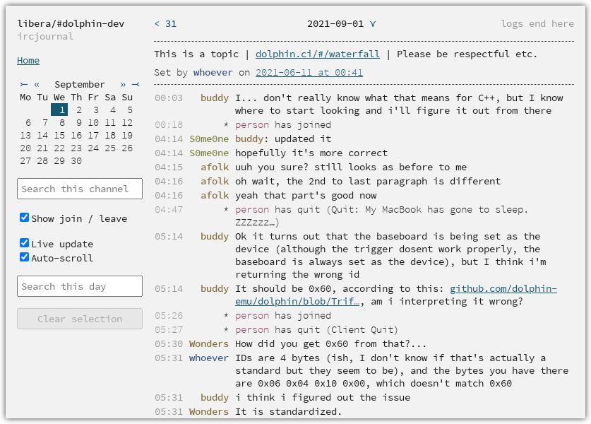

# ircjournal

A lightweight, fast, standalone IRC log viewer for the web, with real-time log
ingestion, written in Rust.
[](https://github.com/Zopieux/ircjournal/actions/workflows/ci.yaml)

<p align="center">
  <a target="_blank" rel="noopener noreferrer" href=".github/screenshot.png"></a>
  <em>Screenshot of the web frontend. Nicks and some content have been changed.</em>
</p>

### Features

* Simple, no-dependency web front-end to browse and full-text search IRC logs.
    * Link to a specific line or block of lines.
    * Full-text server-side search inside a channel, local regexp search.
    * Optional live stream of IRC lines as they get ingested from log files.
    * Responsive layout for small screens.
* Standalone IRC ingestion binary that observes log files for updates.
    * Supported log formats: WeeChat. PRs welcome!

A non-goal of ircjournal is to include an IRC bot that would join channels. It
relies on an existing client's log files.

### Usage

tl;dr:

1. Create an empty [PostgreSQL](#postgresql-database) database.
2. Run [`ircj-watch`](#ircj-watch) close to where log files live.
3. Run [`ircj-serve`](#ircj-serve) close to your webserver.

```text
                                           ╔═════════════════╗
         ┌─────────────┐                   ║ ┌─────────────┐ ║
User ◄───► Browser     │                   ║ │ IRC client  │ ║
         └──────▲──────┘                   ║ │ (log files) │ ║
                │                          ║ └──────┬──────┘ ║
       ╔════════╪════════╗                 ║        │        ║
       ║ ┌──────▼──────┐ ║                 ║ ┌──────▼──────┐ ║
       ║ │ Frontend    │ ║                 ║ │ Ingestor    │ ║
       ║ │ ircj-serve  │ ║                 ║ │ ircj-watch  │ ║
       ║ └──────▲──────┘ ║                 ║ └──────┬──────┘ ║
       ╚════════╪════════╝                 ╚════════╪════════╝
                │        ╔═════════════════╗        │
                │        ║ ┌─────────────┐ ║        │
                └────────╫─► PostgreSQL  ◄─╫────────┘
                         ║ └─────────────┘ ║
                         ╚═════════════════╝
```

*Double-line boxes can be on the same machine or behind network boundaries,
making for a pretty flexible setup.*

#### PostgreSQL database

ircjournal relies on a PostgreSQL database for full-text search indexing and the
notification mechanism (live updates). This is the only runtime dependency.

Please create an empty database and associated user. ircjournal will set up the
rest on the first run.

#### ircj-watch

Run `ircj-watch` on the machine with the IRC log files. It will watch for
changes and save new lines to the database. You can run `irc-watcher` on
multiple machines. Each instance can ingest any number of log files.

You can configure the binary using either `IRCJ_*` environment variables or a
file named `ircj-watch.toml` in `$CWD`.  
Available knobs: [irc-watch config](ircj-watch/src/main.rs#L21).

The most important config knob is the list of log files
to [backfill](#backfilling-existing-logs)
and observe for changes, for example as env variable (the square brackets are
significant):

    IRCJ_PATHS=[/path/to/log, ...]

or with `ircj-watch.toml`:

    paths = ["/path/to/log", ...]

#### ircj-serve

Run `ircj-serve` to expose the web interface, directly or behind a reverse-proxy
server such as nginx.

You can configure the binary using either `IRCJ_*` environment variables or a
file named `ircj-serve.toml` in `$CWD`.  
Available knobs: [irc-serve config](ircj-serve/src/main.rs#L7)
, [rocket config](https://rocket.rs/v0.5-rc/guide/configuration/#overview).

There are a few lines of embedded JavaScript to implement local search, "show
join/part" filtering and live updates. The interface remains usable with
JavaScript disabled.

#### Backfilling existing logs

The first time you run `ircj-watch` on an empty database, or whenever you add a
new log file, or if new lines were added in a channel while `ircj-watch` was *
not* running, the program will attempt to find the last recorded line in the
file and backfill (save) the missing new lines in the database. It will then
continue watching for new lines, as usual.

You can therefore safely restart the `ircj-watch` binary at any time, and it
should pick up where it left off.

#### Logging level

ircjournal uses the popular `env_logger` crate. You
can [customize log levels](https://docs.rs/env_logger/*/env_logger/#enabling-logging)
at per-module granularity with the `RUST_LOG` environment variable. For
instance, use `RUST_LOG=warn,ircj_serve=info` to warn by default, and have
info-level logs for `ircj-serve`.

### Acknowledgments

The amazing [whitequark/irclogger](https://github.com/whitequark/irclogger/)
project motivated me to develop a similar IRC log viewer to try my hands at
Rust.

### License

[GNU General Public License v3.0 only](https://spdx.org/licenses/GPL-3.0.html).
